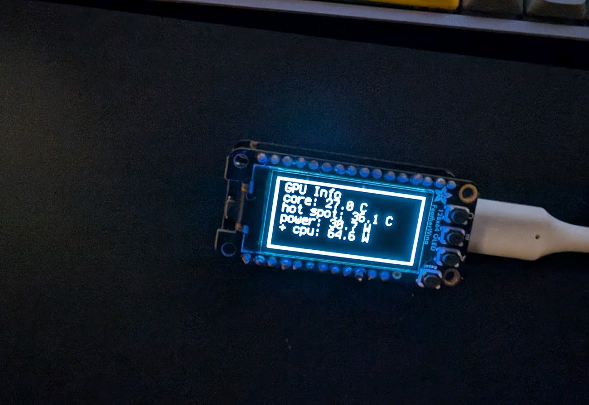

# desktop-mon

Monitors cpu/gpu temps on Windows and periodically writes data to an Adafruit OLED display over serial



## sysinfo-publisher

> [!NOTE]
> This only works on Windows and also assumes an Nvidia GPU. The CPU temp properties are also hardcoded

C# application that publishes system data over serial to the display. [LibreHardwareMonitorLib](https://github.com/LibreHardwareMonitor/LibreHardwareMonitor) is used for getting info on periphials and is managed thru NuGet.

### Publish data on the console

```bat
cd sysinfo-publisher
dotnet run
```

Output looks like

```json
{"GpuCoreTempC":26,"GpuHotSpotTempC":34.34375,"GpuPowerWatts":27.809999465942383,"CpuCoreTempC":50.50000762939453,"CpuCcdTempC":35.75,"CpuPackagePowerWatts":36.78437042236328}
{"GpuCoreTempC":26,"GpuHotSpotTempC":34.34375,"GpuPowerWatts":27.611000061035156,"CpuCoreTempC":48.87500762939453,"CpuCcdTempC":36.625,"CpuPackagePowerWatts":37.46200942993164}
```

### Publish data a given serial port

This assumes that there is a display listening on the COM3 serial port

```bat
cd sysinfo-publisher
dotnet run -c Release -- COM3
```

## display

CircuitPython application that listens for system info over serial and then writes it out to an OLED display.

Display - Adafruit FeatherWing OLED - 128x64 OLED Add-on For Feather - STEMMA QT / Qwiic <https://www.adafruit.com/product/4650>

Controller - Adafruit Feather RP2040  (<https://www.adafruit.com/product/4884>)

### CircuitPython setup

Since Adafruit recommends CircuitPython, I decided to use that for the display.

CircuitPython Install guide: <https://learn.adafruit.com/welcome-to-circuitpython/circuitpython-libraries>

In order to deploy to the RP2040, you hold down "BOOTSEL" then plug it into the compute over USB-C. The CircuitPython uf2 can be moved into it to set up CircuitPython. You can then download the CircuitPython bundle from <https://github.com/adafruit/Adafruit_CircuitPython_Bundle/releases/tag/20240910>. Not all the libraries are needed, we only end up using:

- `adafruit_bitmap_font/`
- `adafruit_display_text/`
- `adafruit_displayio_sh1107.mpy`
- `adafruit_ticks.mpy`

It's possible that not all of these are needed, but this is the minimum working set I ended upw ith.

Drag these files/folders and copy them to the lib/ folder on the CIRCUITPY mount.

Then finally copy [display/code.py](display/code.py) into the root dir of CIRCUITPY as code.py.

If connecting over serial directly for debugging, you can set the baud rate to 115200 and the line ending to "CR".

## How to use

Connect the display to your machine over usb-c, then start the sysinfo publisher with the connected serial port to provide data to it.
Values should start populating up on the display isntead of the '0' watts that it starts out with.

Display controls:

- Press and hold 'A' to switch to the GPU info screen
- Press and hold 'B' to switch to the CPU info screen
- Press and hold 'C' to switch to an 'other' screen that doesn't really show anything

## TODO

- [x] Set up C# project to use Librehardwaremonitor
- [x] Retrieve system data using Librehardwaremonitor
- [x] Find format to publish data over serial (json?)
- [x] Figure out what toolchain to use for display + controller
  - The display has CircuitPython and Arduino support. The controller has unofficial arduino support, PicoSDK C++ support, MicroPython, and CircuitPython support
  - For CircuitPython, the RP2040 build has displayio support <https://docs.circuitpython.org/en/latest/shared-bindings/support_matrix.html?filter=displayio> which is necessary
- [x] Get display built and tested
- [x] test sysinfo publisher and display to make sure they work together
- [x] configure button to swap between cpu/gpu info
- [ ] Print enclosure
  - Adafruit has some enclosures that you can print <https://www.printables.com/model/7191>. None are specific to this display, but they're similar shapes and I'll likely base them off of this. Sadly, they're wider than I'd prefer and the USB-C port is too narrow so I'll need to do some design of my own.
